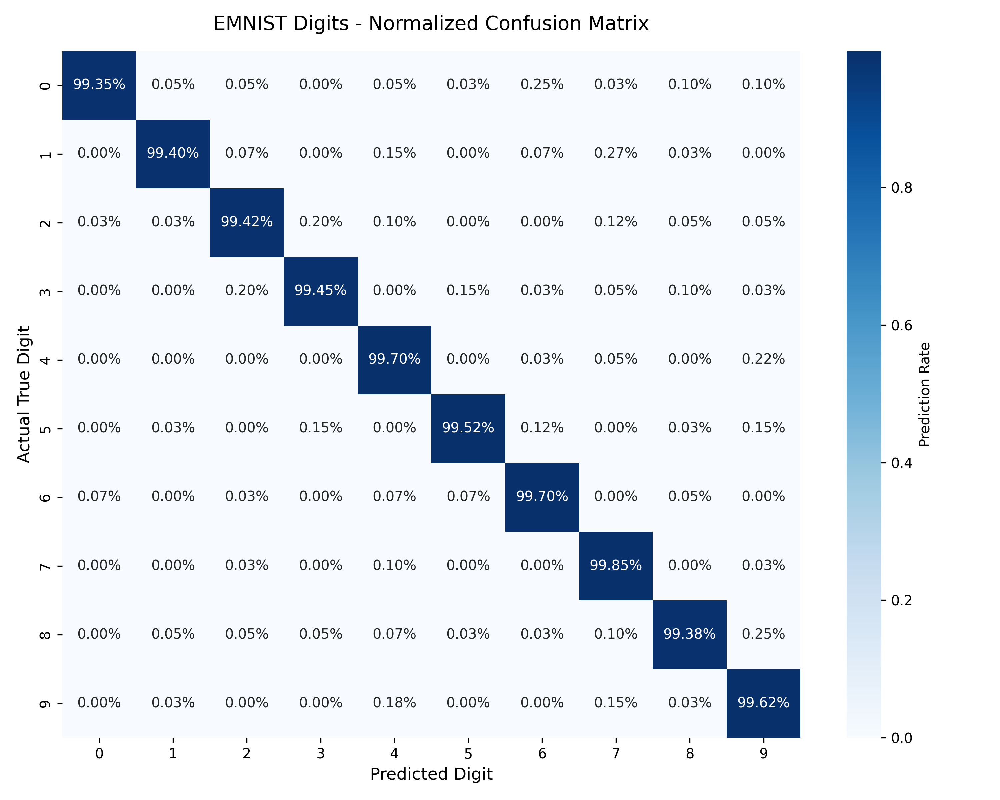
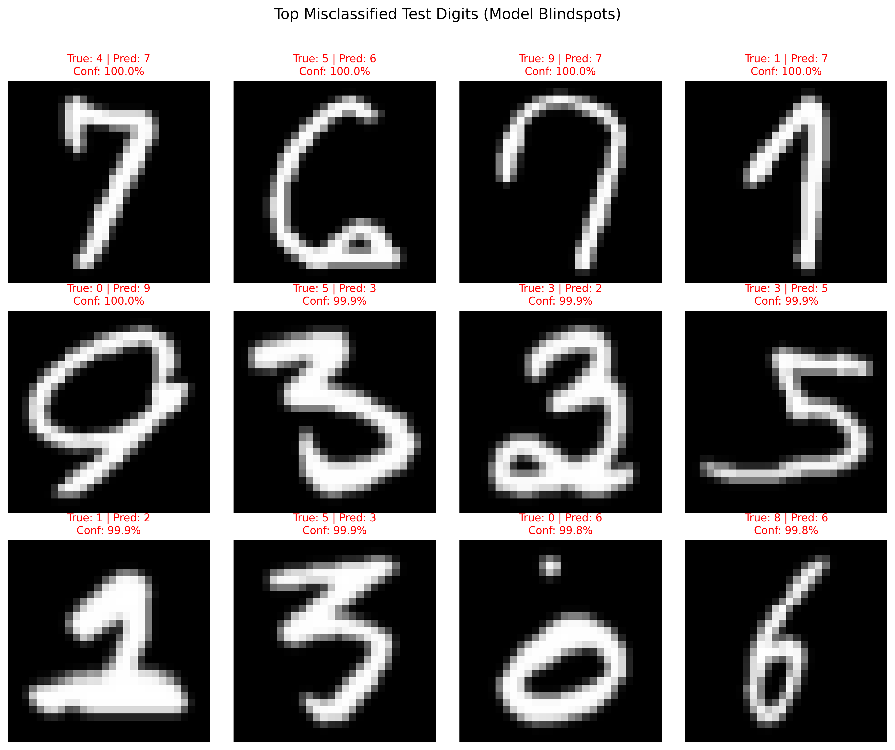

# 🔢 ML Digit Analyser & Diagnostic Suite

[](https://www.python.org/downloads/)
[](https://tensorflow.org/)
[](https://streamlit.io/)
[]()
[](https://opensource.org/licenses/MIT)

An end-to-end Deep Learning system and interactive diagnostic suite for real-time handwritten digit recognition, trained on **280,000 samples from the EMNIST Digits benchmark**.

Unlike basic MNIST tutorial scripts, this project features:
- **Robust Real-World Preprocessing**: Solves the white-on-black color inversion problem and centers hand-drawn input using **center-of-mass alignment** and **aspect-ratio bounding-box scaling**.
- **Modern CNN Architecture**: Built with Keras 3, utilizing **Batch Normalization** and **Dropout (0.25 & 0.50)** to eliminate overfitting.
- **Production Training Pipeline**: Employs real-time **Data Augmentation** (rotation, translation, zoom), **EarlyStopping**, **ReduceLROnPlateau**, and **ModelCheckpoint**.
- **In-Depth Diagnostic Suite**: Complete evaluation pipeline generating normalized **Confusion Matrices**, **Per-Digit Precision/Recall/F1-Scores**, and an **Error Gallery** showing the model's highest-confidence mistakes.
- **Interactive Streamlit Web App**: Includes a live drawing canvas, instant probability distribution bar charts, file upload inference, and transparency views showing what the CNN sees.

---

## 📊 Evaluation & Model Performance

Evaluated across **40,000 unseen test images** from the EMNIST Digits test set:

| Metric | Score |
| :--- | :--- |
| **Overall Test Accuracy** | **99.54%** |
| **Overall Test Loss** | **0.0164** |
| **Average Precision** | **99.54%** |
| **Average Recall** | **99.54%** |
| **Average F1-Score** | **99.54%** |

### Per-Digit Performance Breakdown

```text
              precision    recall  f1-score   support

           0     0.9990    0.9935    0.9962      4000
           1     0.9982    0.9940    0.9961      4000
           2     0.9957    0.9942    0.9950      4000
           3     0.9960    0.9945    0.9952      4000
           4     0.9928    0.9970    0.9949      4000
           5     0.9972    0.9952    0.9962      4000
           6     0.9948    0.9970    0.9959      4000
           7     0.9923    0.9985    0.9954      4000
           8     0.9962    0.9938    0.9950      4000
           9     0.9918    0.9962    0.9940      4000

    accuracy                         0.9954     40000
```

### Visual Diagnostics

| Normalized Confusion Matrix | Hardest Misclassified Examples |
| :---: | :---: |
|  |  |

---

## 🏗️ Neural Network Architecture

```text
Input (28 × 28 × 1)
   │
   ├── Conv2D (32 filters, 3×3, ReLU, Same Padding)
   ├── BatchNormalization
   ├── MaxPooling2D (2×2)
   ├── Dropout (0.25)
   │
   ├── Conv2D (64 filters, 3×3, ReLU, Same Padding)
   ├── BatchNormalization
   ├── MaxPooling2D (2×2)
   ├── Dropout (0.25)
   │
   ├── Flatten (3,136 features)
   ├── Dense (128 units, ReLU)
   ├── BatchNormalization
   ├── Dropout (0.50)
   │
   └── Dense Output (10 units, Softmax) ──> Probabilities [0 - 9]
```

---

## 📁 Repository Structure

```text
ML_Digit_Analyser/
├── .gitignore               # Excludes large binaries, cache, and local datasets
├── requirements.txt         # Pinned project dependencies
├── README.md                # Project documentation and benchmarks
├── app.py                   # Interactive Streamlit Web Application
├── models/
│   └── best_digit_model.keras  # High-accuracy trained CNN weights
├── reports/
│   ├── classification_report.txt  # Precision/Recall/F1 text metrics
│   ├── confusion_matrix.png       # Normalized 10x10 heatmap
│   └── misclassified_gallery.png  # Visual gallery of edge cases
└── src/
    ├── __init__.py
    ├── model.py             # CNN architecture definition
    ├── preprocess.py        # Image centering, inversion & bounding-box scaling
    ├── train.py             # Full training pipeline with data augmentation & callbacks
    └── evaluate.py          # Diagnostic evaluation suite
```

---

## 🚀 Quickstart Guide

### 1. Clone the Repository & Set Up Conda Environment

```bash
git clone https://github.com/Deepesh70/ML_Digit_Analyser.git
cd ML_Digit_Analyser

# Create and activate conda environment
conda create -n digit_analyser python=3.10 -y
conda activate digit_analyser

# Install dependencies
pip install -r requirements.txt
```

### 2. Launch the Interactive Web Application

```bash
streamlit run app.py
```
Open your browser at `http://localhost:8501` to start drawing digits!

---

## 🛠️ Pipeline Scripts

* **Run Model Architecture Check**:
  ```bash
  python src/model.py
  ```
* **Test the Preprocessing Pipeline**:
  ```bash
  python src/preprocess.py
  ```
* **Train a Fresh Model on EMNIST**:
  ```bash
  python src/train.py
  ```
* **Run Diagnostics & Export Visual Charts**:
  ```bash
  python src/evaluate.py
  ```

---

## 📜 License
This project is open-source under the [MIT License](LICENSE).
